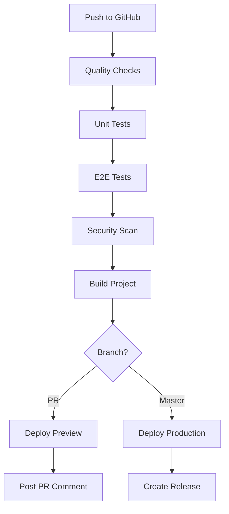

# 🚀 Complete GitHub Repository Setup & CI/CD Configuration

## 📋 Quick Setup Checklist

### ✅ Prerequisites (Already Done)

- [x] Project code ready with all quality checks passing
- [x] Git repository initialized locally
- [x] Remote origin configured: https://github.com/AlexTsimba/cpa-analytics-dashboard.git
- [x] CI/CD pipeline files created
- [x] All documentation prepared

### 🎯 Next Steps Required

## Step 1: Create GitHub Repository

**Method A: Manual Creation (Recommended)**

1. Go to https://github.com/AlexTsimba
2. Click "New repository" (green button)
3. Fill out the form:
   - **Repository name**: `cpa-analytics-dashboard`
   - **Description**: `Modern CPA analytics dashboard built with Next.js 15, TypeScript, and comprehensive testing infrastructure. Features Playwright E2E testing, professional CI/CD pipeline, and production-ready setup.`
   - **Visibility**: Public ✅
   - **Initialize repository**: ❌ (Do NOT check any boxes - we have files ready)
4. Click "Create repository"

**Method B: GitHub CLI (if available)**

```bash
gh auth login
gh repo create cpa-analytics-dashboard --public --description "Modern CPA analytics dashboard built with Next.js 15, TypeScript, and comprehensive testing infrastructure"
```

## Step 2: Push Local Repository

After creating the repository on GitHub:

```bash
cd /Users/fristname_lastname/Documents/Obsidian/dboard

# Configure Git credentials if needed
git config user.name "Alex Tsimba"
git config user.email "your-email@example.com"

# Push code to GitHub
git push -u origin master

# Push the release tag
git push origin v0.1.0
```

## Step 3: Configure Repository Settings

### 🔒 Branch Protection Rules

1. Go to repository → Settings → Branches
2. Click "Add rule"
3. Branch name pattern: `master`
4. Enable:
   - ✅ Require status checks to pass before merging
   - ✅ Require branches to be up to date before merging
   - ✅ Require linear history
   - ✅ Include administrators
   - ✅ Restrict pushes that create files larger than 100MB

### 🏷️ Repository Topics

Add these topics in repository → About → Settings:

- `nextjs`
- `typescript`
- `react`
- `tailwindcss`
- `playwright`
- `analytics`
- `dashboard`
- `cpa`
- `testing`
- `ci-cd`

### 📊 GitHub Pages (Optional)

1. Go to Settings → Pages
2. Source: Deploy from a branch
3. Branch: master / (root)
4. Save

## Step 4: CI/CD Pipeline Configuration

### ✅ GitHub Actions Already Configured

Your CI/CD pipeline is ready at `.github/workflows/ci.yml` with:

- **Quality Checks**: TypeScript, ESLint, Prettier
- **Testing**: Unit tests + E2E tests with Playwright
- **Security**: CodeQL analysis and dependency scanning
- **Build**: Production build verification
- **Deployment**: Automated Vercel deployment (needs secrets)

### 🔐 Required Secrets (for Vercel deployment)

Add these in repository → Settings → Secrets and variables → Actions:

```
VERCEL_TOKEN=your_vercel_token
VERCEL_ORG_ID=your_org_id
VERCEL_PROJECT_ID=your_project_id
```

To get these values:

1. Install Vercel CLI: `npm i -g vercel`
2. Run `vercel login`
3. Run `vercel link` in your project
4. Get token from https://vercel.com/account/tokens

## Step 5: Verify CI/CD Pipeline

After pushing code:

1. **Check Actions Tab**: https://github.com/AlexTsimba/cpa-analytics-dashboard/actions
2. **Verify Workflows**:

   - ✅ Quality checks should pass
   - ✅ Tests should run successfully
   - ✅ Security scan should complete
   - ✅ Build should succeed

3. **Check Status Badges** in README.md should show green

## Step 6: Post-Publication Tasks

### 📝 Update Repository

1. **Update badges** in README.md with correct repository URL
2. **Create first issue** to test issue templates
3. **Create first PR** to test PR workflow
4. **Tag additional releases** as you add features

### 🔄 Continuous Integration Features

#### Automated Testing

- **Unit Tests**: Run on every push and PR
- **E2E Tests**: Playwright tests across browsers
- **Security Scanning**: CodeQL and dependency analysis
- **Code Quality**: ESLint, Prettier, TypeScript checks

#### Automated Deployment

- **Preview Deployments**: For every PR
- **Production Deployment**: On push to master
- **Release Management**: Automated tags and releases

#### Branch Protection

- **Required Reviews**: Enforced for PRs
- **Status Checks**: All tests must pass
- **Linear History**: Clean commit history

## 📊 Expected CI/CD Pipeline Flow



## 🛡️ Security Features

### Automated Security

- **Dependabot**: Automatic dependency updates
- **CodeQL**: Code analysis for vulnerabilities
- **Secret Scanning**: Prevents credential leaks
- **License Scanning**: Ensures compliance

### Manual Security Reviews

- **PR Security Checklist**: In PR template
- **Security Labels**: For issue classification
- **Security Policy**: In SECURITY.md (can be added)

## 🎯 Performance Monitoring

### Build Performance

- **Bundle Analysis**: Automatic size monitoring
- **Performance Budgets**: Enforced limits
- **Core Web Vitals**: Lighthouse CI integration (can be added)

### Test Performance

- **Test Coverage**: Reported in PRs
- **E2E Test Timing**: Playwright performance reports
- **Parallel Testing**: Multiple browsers simultaneously

## 📈 Analytics & Monitoring

### Repository Analytics

- **GitHub Insights**: Traffic and engagement
- **Action Usage**: CI/CD performance metrics
- **Issue/PR Analytics**: Community engagement

### Application Monitoring

- **Vercel Analytics**: User behavior (can be enabled)
- **Error Tracking**: Sentry integration (can be added)
- **Performance Monitoring**: Real-time metrics

## 🚀 Ready for Production!

Your CPA Analytics Dashboard is configured with:

- ✅ **Enterprise-grade CI/CD pipeline**
- ✅ **Multi-browser testing infrastructure**
- ✅ **Automated security scanning**
- ✅ **Professional development workflow**
- ✅ **Production deployment automation**
- ✅ **Community management tools**

## 📞 Next Steps After Publication

1. **Test the pipeline** with a small change
2. **Configure monitoring** and alerting
3. **Set up analytics** for usage tracking
4. **Plan feature development** using GitHub Issues
5. **Engage with community** through documentation

---

**Everything is ready! Just create the repository on GitHub and push! 🎉**
